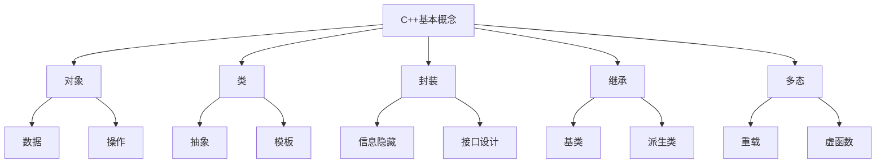
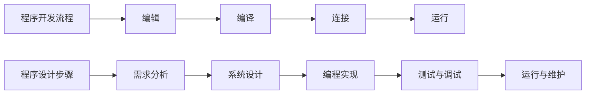
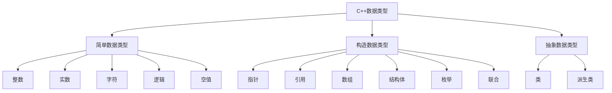
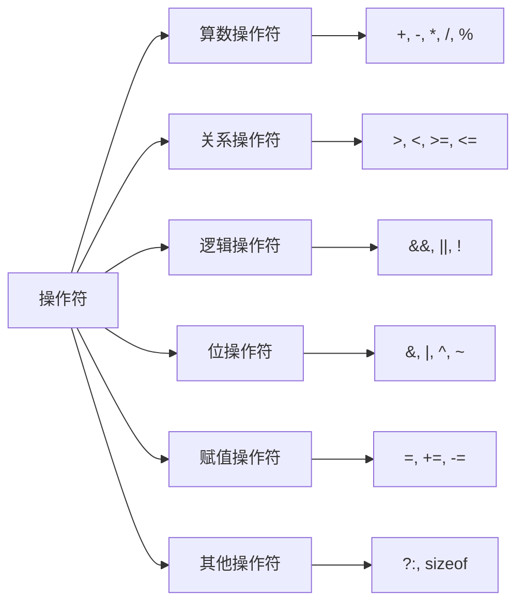
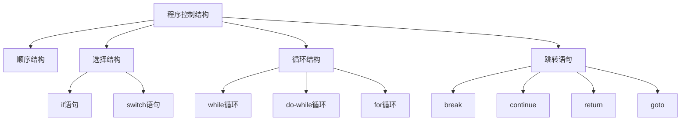
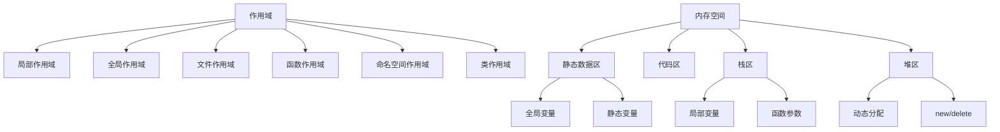
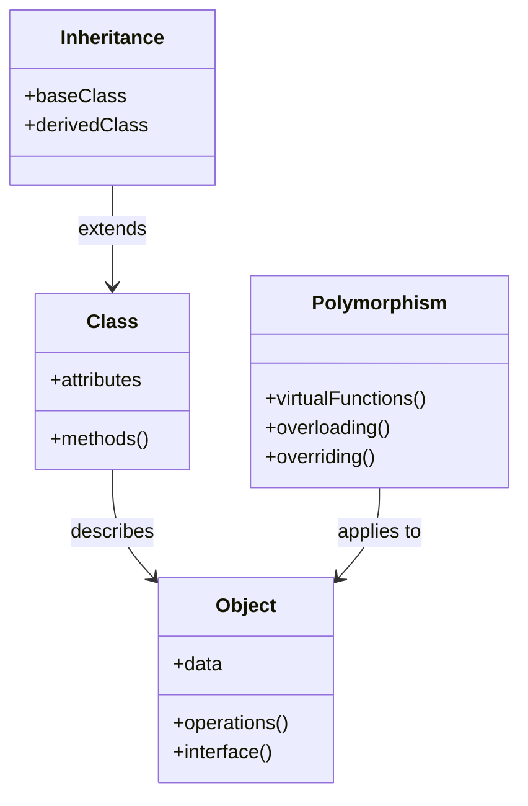
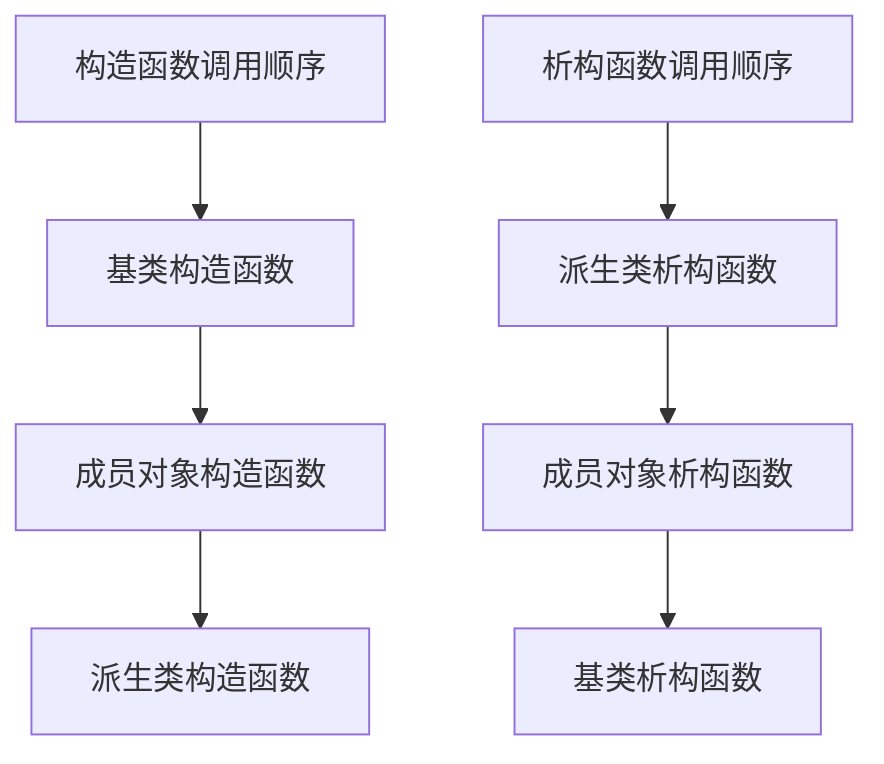
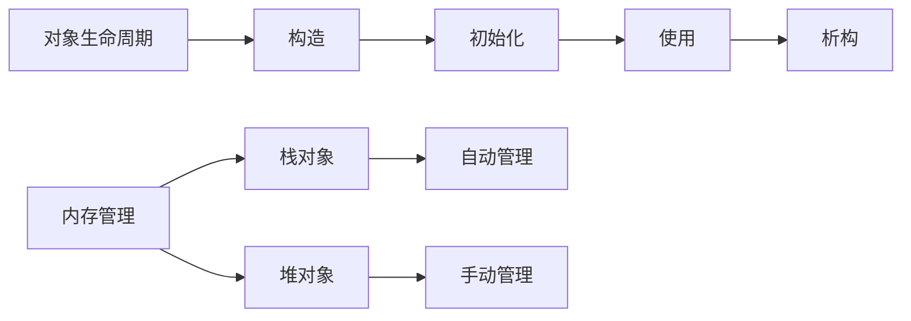

# C++知识点整理

## 第一章：C++语言基础






## 第二章：C++数据类型与基本语法

## 2.1 数据类型概述

### 基本数据类型

<style>
.type-table {
    border-collapse: collapse;
    width: 100%;
    margin: 20px 0;
}
.type-table th, .type-table td {
    border: 1px solid #ddd;
    padding: 8px;
    text-align: left;
}
.type-table th {
    background-color: #f2f2f2;
}
.type-table tr:nth-child(even) {
    background-color: #f9f9f9;
}
</style>

<table class="type-table">
<tr>
    <th>类型</th>
    <th>大小</th>
    <th>范围</th>
    <th>示例</th>
</tr>
<tr>
    <td>short int</td>
    <td>2字节</td>
    <td>-32,768 到 32,767</td>
    <td>short x = 100;</td>
</tr>
<tr>
    <td>int</td>
    <td>4字节</td>
    <td>-2,147,483,648 到 2,147,483,647</td>
    <td>int y = 1000;</td>
</tr>
<tr>
    <td>long long int</td>
    <td>8字节</td>
    <td>-9,223,372,036,854,775,808 到 9,223,372,036,854,775,807</td>
    <td>long long z = 1000000000LL;</td>
</tr>
<tr>
    <td>float</td>
    <td>4字节</td>
    <td>±3.4E±38 (7位精度)</td>
    <td>float f = 3.14f;</td>
</tr>
<tr>
    <td>double</td>
    <td>8字节</td>
    <td>±1.7E±308 (15位精度)</td>
    <td>double d = 3.14159;</td>
</tr>
<tr>
    <td>char</td>
    <td>1字节</td>
    <td>-128 到 127或0 到 255</td>
    <td>char c = 'A';</td>
</tr>
<tr>
    <td>bool</td>
    <td>1字节</td>
    <td>true 或 false</td>
    <td>bool flag = true;</td>
</tr>
<tr>
    <td>void</td>
    <td>0字节</td>
    <td>无值</td>
    <td>void* ptr;</td>
</tr>
</table>

### 示例代码

```cpp
#include <iostream>
using namespace std;

int main() {
    // 数值类型示例
    int integer = 42;
    float floating = 3.14f;
    double precise = 3.14159265359;

    // 字符类型示例
    char character = 'A';
    bool boolean = true;

    // 类型转换示例
    int converted = static_cast<int>(floating);

    cout << "整数: " << integer << endl;
    cout << "浮点数: " << floating << endl;
    cout << "双精度: " << precise << endl;
    cout << "字符: " << character << endl;
    cout << "布尔值: " << boolalpha << boolean << endl;
    cout << "转换后的值: " << converted << endl;

    return 0;
}
```

### 思考题

#### 1. 类型溢出问题

**问题**：给定以下代码，输出结果是什么？为什么？

```cpp
unsigned char x = 255;
x++;
cout << (int)x << endl;
```

**解答**：

- 输出结果为 0
- 原因：unsigned char 的范围是 0-255，当 x 为 255 时再自增，会发生溢出，循环回到 0
- 这展示了数据类型的循环特性和处理溢出的重要性

#### 2. 浮点数精度问题

**问题**：为什么下面的代码可能输出 false？

```cpp
float a = 0.1f;
if (a + a + a == 0.3f)
    cout << "true" << endl;
else
    cout << "false" << endl;
```

**解答**：

- 输出为 false
- 原因：浮点数在计算机中是以二进制形式存储的，某些十进制小数无法精确表示
- 0.1 在二进制中是无限循环小数，存储时会发生截断，累加时误差会放大
- 在需要精确计算时，应使用定点数或专门的数值计算库

#### 3. 挑战思考题：类型转换与优先级

**问题**：分析以下代码的输出结果：

```cpp
int i = 1;
char c = 'A';
double d = 0.5;
cout << sizeof(i + c) << " " << sizeof(c + d) << " " << sizeof(1.0f + 2.0) << endl;
```

**解答**：

- 输出：4 8 8
- 解释：
  1. `i + c`：char 会被提升为 int，结果是 int 类型（4 字节）
  2. `c + d`：char 先转为 int，然后与 double 运算，结果是 double（8 字节）
  3. `1.0f + 2.0`：float 与 double 运算，结果是 double（8 字节）
- 这展示了 C++中的类型提升规则和算术转换的优先级

### 进阶知识点

1. **类型限定符**：

   - const：声明常量
   - volatile：告诉编译器变量可能会被外部修改
   - mutable：允许 const 对象中的成员被修改

2. **数据对齐**：
   - 不同的数据类型有不同的对齐要求
   - 可以使用#pragma pack()控制对齐
   - 影响结构体的大小和内存访问效率

```cpp
// 数据对齐示例
struct Example1 {
    char c;     // 1字节
    int i;      // 4字节
    double d;   // 8字节
};

struct Example2 {
    double d;   // 8字节
    int i;      // 4字节
    char c;     // 1字节
};

cout << sizeof(Example1) << endl; // 输出可能大于13
cout << sizeof(Example2) << endl; // 输出可能不同于Example1
```



c. 常量：字面常量、符号常量
（1）字面常量：整数类型、实数类型、字符类型、字符串
（2）符号常量
d. 操作符：
（1）算数操作符：+、-、\*、/、%、++、--
（2）关系操作符：>、<、>=、<=、==、!=
（3）逻辑操作符：&&、｜｜、! （注意短路求值）
（4）逻辑位操作符：～（按位取反）、&（按位取与）、｜（按位取或）、^（按位异或）（x^a）^a=x、<<、>>
（5）赋值操作符：（简单）=、（复合）+=、-=、\*=、/=、%=、&=、｜=、^=、<<=、>>=
（6）其他操作符：?: 、 ， 、sizeof



e. 类型转换：
（1）隐式类型转换
（2）显式类型转换
f. 优先级与结合性：
（1）优先级：决定表达式中各种不同的运算符起作用的优先次序
（2）结合性：在相邻的两个运算符的具有同等优先级时，决定表达式的结合方向

## 第三章：

a. 语句
（1）顺序执行语句：表达式语句、复合语句、空语句
（2）选择执行语句：if 语句、switch 语句
（3）循环执行语句：while 语句、while-do 语句、for 语句
（4）无条件转移语句：goto 语句、break 语句、continue 语句、return 语句
b. C++内部不能定义局部常量



## 第四章：

a. 子程序间的数据传递
（1）值传递
（2）地址传递
（3）引用传递
b. 参数传递
（1）值传递
（2）地址传递
（3）引用传递
c. 全局变量与局部变量
d. 命名空间：在一个命名空间中定义的全局标识符，其作用域为该命名空间
e. 作用域与生存期
（1）作用域：局部作用域、全局作用域、文件作用域、函数作用域、函数原型作用域、命名空间作用域、类作用域
（2）生存期：静态生存期、自动生存期、动态生存期

1. static：全局变量改为文件作用域、局部变量具有静态生存期
2. auto：局部变量默认、形参
3. register：使用频率高的局部变量
4. 静态生存期：static 局部变量、全局变量
5. 自动生存期：auto 局部变量、函数形参、register
6. 动态生存期：new、delete、malloc、free
   （3）内存空间：静态数据区、代码区、栈区、堆区
   1）静态数据区（大小固定）：全局变量、static 局部变量、某些常量
   2）代码区（大小固定）：函数代码
   3）栈区：auto 局部变量、函数形参、函数调用有关信息
   4）堆区：动态变量内存分配



f. 内联函数
（1）内联函数：在函数定义中的返回值类型之前加上关键字 inline
（2）作用：建议编译程序把该函数的函数体展开到调用点，避免函数调用的开销，提高函数调用的效率

## 第五章：

- a. 数组类型（排序）
（1）定义：一种由固定多个同类型的具有一定次序关系的元素所构成的复合数据类型
（2）排序：
   - 冒泡排序法：

    ```CPP
    void BubbleSort(int arr[], int n)
    {
        for (int i = 0; n - i - 1; j++)
        {
            if (arr[j] > arr[j + 1])
            {
                int temp = arr[j];
                arr[j] = arr[j + 1];
                arr[j + 1] = temp;
            }
        }
    }
    ```

    - 选择排序法：

    ```CPP
    void selectSort(int a[], int len)
    {
        int minindex, temp;
        for(int i = 0;len-1;i++)
        {
            minindex = i;
            for(int j = i+1; j<len; j++)
            {
                if(a[j]<a[minindex])
                minindex = j;
            }
            temp = a[i];
            a[i] = a[minindex];
            a[minindex] = temp;
        }
    }
    ```

    - 快速排序法：

    ```CPP
    void quickSort(int a[], int low ,int high)
    {
        if(low<high) //判断是否满足排序条件，递归的终止条件
        {
        int i = low, j = high;
        int x = a[low];
        //将待排序数组的第一个元素作为哨兵，将数组划分为大于哨兵以及小于哨兵的两部分

        while(i<j)
        {
        while(i<j && a[j] >= x) j--;
        //从最右侧元素开始，如果比哨兵大，那么它的位置就正确，然后判断前一个元素，直到不满足条件

                if(i<j) a[i++] = a[j];

        //把不满足位次条件的那个元素值赋值给第一个元素，（也即是哨兵元素，此时哨兵已经保存在 x 中，不会丢失）并把 i 的加 1

                while(i<j && a[i] <= x) i++;

        //换成左侧下标为 i 的元素开始与哨兵比较大小，比其小，那么它所处的位置就正确，然后判断后一个，直到不满足条件

                if(i<j) a[j--] = a[i];

        //把不满足位次条件的那个元素值赋值给下标为 j 的元素，（下标为 j 的元素已经保存到前面，不会丢失）并把 j 的加 1
        }

                    a[i] = x;

        //完成一次排序，把哨兵赋值到下标为 i 的位置，即前面的都比它小，后面的都比它大
        quickSort(a, low ,i-1);
        //递归进行哨兵前后两部分元素排序，low,high 的值不发生变化，i 处于中间
        quickSort(a, i+1 ,high);
    }
    ```

- b. 枚举类型（enum）
- c. 结构体（struct）
- d. 联合类型（union）
- e. 指针类型
  - 定义：指针是内存地址的抽象表示
  -  （void*）输出字符串内存首地址
  - const
      - const int* p：指向常量的指针（不能改变元素的值）
      - int\* const p：指针类型的常量（可以改变所指变量的值，但不能改变指针本身的值）
      - const 成员函数只能获取对象的状态，而不能改变对象的状态
- 交换参数
1）多级指针

```cpp
void swap(int **x,int **y)
{
	int *t;
	t=*x;
	*x=*y;
	*y=t;
}
```

2）指针加引用

```cpp
void swap(int _&x,int _&y)
{
	int *t;
	t=x;x=y;y=t;
}
3）引用
void swap(int &x,int &y)
{
	int t;
	t=x;x=y;y=t;
}
```

4）指针

```cpp
void swap (int *x, int *y)
{
	int t;
	t = *x;
	*x = *y;
	\*y = t;
}
```

- f. 链表
- g. 引用类型
  - （1）作为参数：相当于别名，可提高参数传递效率
  - （2）引用：直接访问，参数是一个变量的名字
  指针：间接访问，参数是一个变量的地址
  - （3）不能再引用其他变量

## 第六章：







- a. 面向对象
    （1）面向对象程序设计：把程序构造成由若干对象组成，每个对象由一些数据以及对这些数据所能实施的操作构成；对对象的操作是通过向包含数据的对象发消息来实现的；对象的特征由相应的类来描述，一个类所描述的对象特征可以从其他类继承；
    （2）对象：对象构成了面向对象程序的基本计算单位，它由数据、操作以及对外接口构成；
    （3）通信：通信是指对象间的消息传递，它是引起面向对象程序进行计算的唯一方式；
    （4）类：类描述了一组具有相同特征的对象；
    （5）类的成员：数据成员和成员函数；
    （6）继承：继承是指对象的一部分特征描述可以从其他的类获得；（派生类&基类）
    （7）对象和类体现了数据抽象和封装的概念。类是对象的集合；对象是类的实例。
    （8）多态性：某一论域中的一个元素存在多种解释；不同的对象调用相同名称的函数。
    （9）绑定：指对多态元素确定使用的过程，即确定对多态元素的某个使用是多态元素的哪一种形式；（静态绑定&动态绑定）
    （10）类属性：指一个程序实体能对多种类型的数据进行操作或描述的特性。通过指针和函数模板实现类属函数；通过联合类型和类模板实现类属类型。


- b. 数据成员
    - （1）数据成员初始化：赋值函数、构造函数、成员初始化表
    - （2）信息隐藏：public、private、protected
- c. 对象
    - （1）创建方式：直接方式、间接方式
      -   1）直接方式：A a；
       - 2）间接方式：A \*p; p=new A; delete p;
    - （2）如果变量的类型为类，则称变量为对象；
    - （3）this 指针
- d. 构造函数
（1）定义：在对象类中定义或声明的与类同名、无返回值类型的成员函数；
（2）在创建对象时，构造函数自动调用；创建之后不能再调用；
（3）调用顺序：基类->对象->派生类
（4）构造函数不能被派生类继承
- e. 拷贝构造函数
    - （1）被调用情况：
        - 1）用类的一个已知的对象去初始化该类的另一个对象时；
        - 2）函数的形参是类的对象，调用函数进行形参和实参的结合时；
        - 3）函数的返回值是类的对象，函数执行完返回调用者。
    - （2）调用顺序：基类的拷贝构造函数 -> 成员对象的拷贝构造函数 -> 派生类的拷贝构造函数
    - （3）深拷贝与浅拷贝示例：

        ```cpp
        class DeepCopyExample {
        private:
            int* data;
            size_t size;
        public:
            // 构造函数
            DeepCopyExample(size_t n) : size(n) {
                data = new int[size];
                for(size_t i = 0; i < size; i++) {
                    data[i] = i;
                }
            }

            // 深拷贝构造函数
            DeepCopyExample(const DeepCopyExample& other) : size(other.size) {
                data = new int[size];
                for(size_t i = 0; i < size; i++) {
                    data[i] = other.data[i];
                }
            }

            // 析构函数
            ~DeepCopyExample() {
                delete[] data;
            }

            // 防止浅拷贝引起的问题，实现赋值运算符
            DeepCopyExample& operator=(const DeepCopyExample& other) {
                if(this != &other) {
                    delete[] data;
                    size = other.size;
                    data = new int[size];
                    for(size_t i = 0; i < size; i++) {
                        data[i] = other.data[i];
                    }
                }
                return *this;
            }
        };
        ```

- （4）思考题：为什么需要检查自赋值？不检查会发生什么问题？


  - 在 C++ 中，当你为一个对象执行赋值操作时，编译器会自动调用赋值运算符（`operator=`）。如果进行的是自赋值（即将对象赋值给自己），C++ 中的赋值操作必须小心处理，以避免意外的行为。自赋值是指一个对象被赋值给它自身，类似于：

  ```cpp
  A a1;
  A a2;
  a1 = a1;  // 自赋值
    ```

  - 为什么 C++ 需要检查自赋值？

    自赋值问题主要出现在涉及动态内存分配、指针或资源管理的对象中，尤其是在深拷贝（deep copy）或资源管理类中。自赋值如果不检查，可能会导致以下问题：

    1. **资源泄漏（Memory Leak）**：
    如果在赋值操作中没有检查自赋值，程序可能会不小心删除已经分配的资源，然后试图再次使用已释放的内存，从而导致内存泄漏或未定义的行为。例如，考虑下面的代码：
    
    ```cpp
    class MyClass {
    private:
        int* data;
    public:
        MyClass(int value) {
            data = new int(value);  // 分配内存
        }
        ~MyClass() {
            delete data;  // 释放内存
        }
        MyClass& operator=(const MyClass& other) {
            // 错误的赋值运算符，没有检查自赋值
            delete data;  // 释放当前资源
            data = new int(*(other.data));  // 分配新的内存
            return *this;
        }
    };
    ```

    如果在 `operator=` 中没有检查 `this == &other`（即检查是否是自赋值），并且 `data` 是动态分配的内存，在执行 `delete data` 后，它会删除原本应该保留的内存，接着再去分配新内存，最终可能会导致对已经删除的内存访问，导致未定义的行为（如访问违规）。

    2. **未定义行为**：
    在自赋值的情况下，如果没有进行检查，可能会尝试访问已经删除或破坏的数据。自赋值操作时，对象的状态可能会在赋值操作过程中被破坏。例如：
    ```cpp
    a1 = a1;  // 没有检查自赋值，可能会破坏 a1 的状态
    ```

    如果赋值运算符没有检查 `this == &other`，可能导致对象的状态在赋值过程中被错误修改，进而导致程序崩溃或其他错误行为。

    3. **数据不一致**：
    自赋值时可能会造成数据不一致。例如，在拷贝赋值中，某些资源可能被重复释放或者重新分配，导致对象不再处于有效的状态。没有检查自赋值会导致一些潜在的资源冲突，导致数据不一致。

    -  如何解决自赋值问题？

    为了解决自赋值的问题，C++ 中的赋值运算符通常会进行一个自赋值检查。常见的自赋值检查方法是判断 `this` 指针与目标对象的地址是否相同。如果相同，则说明是自赋值，应该跳过资源释放和分配过程。正确的实现方法如下：

    ```cpp
    MyClass& operator=(const MyClass& other) {
        if (this == &other) {
            // 如果是自赋值，直接返回，什么都不做
            return *this;
        }

        // 执行正常的赋值操作
        delete data;  // 释放当前对象的资源
        data = new int(*(other.data));  // 分配新的内存
        return *this;
    }
    ```

- f. 转移构造函数
    （1）参数类型：右值引用类型，要求只能是临时对象或要消亡的对象
    （2）意义：用即将消亡的对象去初始化另一个同类的对象
    （3）函数：

    ```cpp
    A(A&& x)
    {
        p=x.p;
        x.p=NULL;
    }
    ```

    （4）完整的移动语义实现示例：

    ```cpp
    class SmartArray {
    private:
        int* data;
        size_t size;

    public:
        // 构造函数
        SmartArray(size_t n) : size(n) {
            data = new int[n];
        }

        // 移动构造函数
        SmartArray(SmartArray&& other) noexcept
            : data(other.data), size(other.size) {
            other.data = nullptr;
            other.size = 0;
        }

        // 移动赋值运算符
        SmartArray& operator=(SmartArray&& other) noexcept {
            if(this != &other) {
                delete[] data;
                data = other.data;
                size = other.size;
                other.data = nullptr;
                other.size = 0;
            }
            return *this;
        }

        // 析构函数
        ~SmartArray() {
            delete[] data;
        }

        // 禁用拷贝构造和拷贝赋值
        SmartArray(const SmartArray&) = delete;
        SmartArray& operator=(const SmartArray&) = delete;
    };

    // 使用示例
    SmartArray createArray(size_t size) {
        return SmartArray(size);  // 返回临时对象，触发移动构造
    }
    ```

    （5）思考题：为什么移动构造函数和移动赋值运算符要标记为 noexcept？

- g. 析构函数
    （1）在对象消亡前，在系统收回它所占的内存空间之前，会自动调用对象类的析构函数。
    （2）数组：delete []p; （[] 必须写，否则只调用数组第一个对象的析构函数）
    （3）调用顺序：派生类->对象->基类
- h. const
    （1）若对象为 const 类，则调用函数必为 const 函数
- i. 静态数据成员
    （1）类的静态成员：静态数据成员、静态成员函数
    （2）静态数据成员往往在类的外部给出定义并进行初始化。
    （3）类定义中的静态数据成员对于该类的所有对象只存在一个拷贝。
    （4）静态成员函数只能访问静态成员；
    （5）静态成员函数没有隐藏的 this 指针（因为静态成员函数对静态数据成员操作，静态数据成员只有一个拷贝）
    （6）私有的
- j. 友元
    （1）在 C++的一个类定义中，可以指定某个全局函数、某个其他类或某个其他类的某个成员函数能直接访问该类的私有和保护成员，分别称为：友元函数、友元类、友元类成员函数，统称友元。
    （2）作用：提高对象私有数据成员的访问效率
    （3）友元函数和运算符重载结合示例：

    ```cpp
    class Complex {
    private:
        double real, imag;

    public:
        Complex(double r = 0, double i = 0) : real(r), imag(i) {}

        // 声明友元函数
        friend Complex operator+(const Complex& a, const Complex& b);
        friend Complex operator*(const Complex& a, const Complex& b);
        friend std::ostream& operator<<(std::ostream& out, const Complex& c);

        // 友元类
        friend class ComplexMatrix;

        // 特定类的友元成员函数
        friend void Calculator::compute(const Complex& c);
    };

    // 友元函数实现
    Complex operator+(const Complex& a, const Complex& b) {
        return Complex(a.real + b.real, a.imag + b.imag);
    }

    Complex operator*(const Complex& a, const Complex& b) {
        return Complex(
            a.real * b.real - a.imag * b.imag,
            a.real * b.imag + a.imag * b.real
        );
    }

    std::ostream& operator<<(std::ostream& out, const Complex& c) {
        out << c.real;
        if(c.imag >= 0) out << "+";
        out << c.imag << "i";
        return out;
    }
    ```

    （4）思考题：为什么 operator<<需要作为友元函数而不是成员函数？

