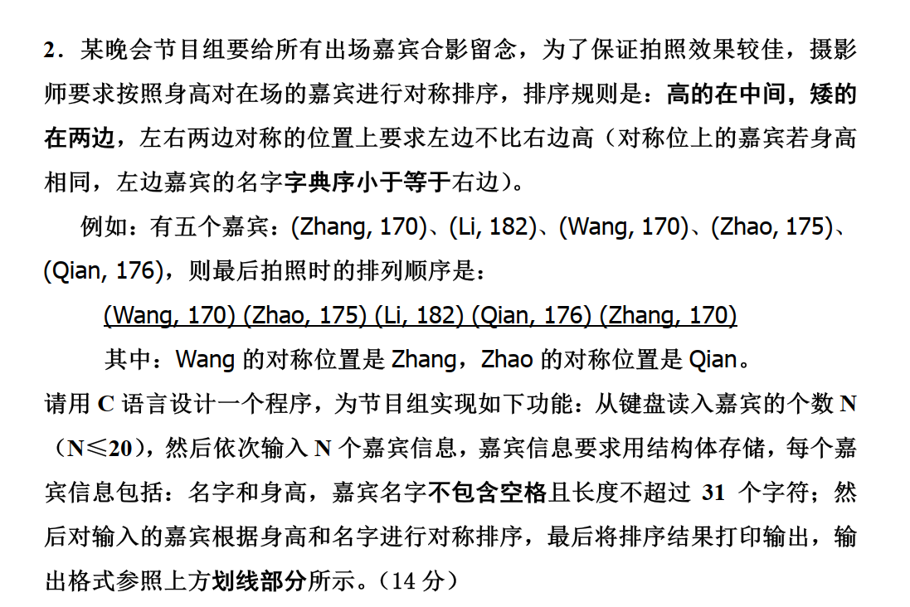

# C语言期末必会10题 ——10题搞定C语言
> [我的b站主页](https://space.bilibili.com/361358232)

> 期末视频讲解
> [XMU朋辈导师：2019期末讲解](https://www.bilibili.com/video/BV1v2CAYnE71?vd_source=b783b218a754d5ce9e2737a645914917)
> [2019期末考试试卷改错题部分](https://www.bilibili.com/video/BV1mm6hYkE7C?vd_source=b783b218a754d5ce9e2737a645914917)
> [2019期末考试试卷程序题部分||C语言期末速成](https://www.bilibili.com/video/BV119rzYeE9X?vd_source=b783b218a754d5ce9e2737a645914917)
## 逻辑终止

``` c
    #include<stdio.h>
    int main(){
        int a,b,c;
        a=5; b=6;
        c=(a<=8)&&(b=7)>5;
        printf("c=%d,b=%d\n",c,b); //逻辑与运算符&&要求两个条件都为真才返回真
        a=5; b=6;
        c=(a<=4)&&(b=7)>5;
        printf("c=%d,b=%d",c,b); //a的值是5，即这个条件为假,整个逻辑表达式 (a<=4)为假，故不会执行第二个条件 (b=7)>5
        return 0;
    }
```

输出结果

``` c
    c=1,b=7
    c=0,b=6

```

``` c
    #include<stdio.h>
    int main(){
        int a,b,d;
        a=5; b=6;
        d=(a>=8)||(b=19)<90; 
        printf("d=%d,b=%d\n",d,b);  //逻辑或运算符||，只要有一个条件为真就返回真
        a=5; b=6;
        d=(a>=4)||(b=19)<90; 
        printf("d=%d,b=%d",d,b); //a>=4 为真，即整个逻辑表达式将返回真，第二个条件(b=19)<90不会被执行
        return 0;
    }
```

输出结果

``` c
    d=1,b=19
    d=1,b=6
```

## 选择分支

毒瘤题，while语句理解,注意判断循环继续条件，注意++无论是否进入循环都会执行。
switch语句的使用，注意case后面不能有变量，只能是常量。并且注意break就好。

``` c
    #include <stdio.h>
    //31
    int main() {
    int a = 0, i;
    for (i = 1; i < 5; i++) {
        switch (i) {
        case 0:
        case 3:
        a += 2;
        case 1:
        case 2:
        a += 3;
        default:
        a += 5;
        }
    }
    printf("%d", a);
    }
```

## 循环控制


``` c
    //程序题考察
    #include <stdio.h>
    #include <string.h>
    #include <stdlib.h>
    #include <math.h>
    #define min(a, b) ((a) < (b) ? (a) : (b))
    #define max(a, b) ((a) > (b) ? (a) : (b))
    #define swap(a, b) { int t = a; a = b; b = t; }
    int main() {
        int n, k;
        char sequence[101];

        // 输入n和k
        scanf("%d %d", &n, &k);
        // 输入编码序列
        scanf("%s", sequence);

        int length = strlen(sequence);
        int result = 0; // 存储最终结果
        bool f = true; // 用于翻转
        // 遍历编码序列
        for (int i = length - 1; i >= 0; i -= k , f^=1) {
        int st = max(i - k + 1, 0);
        int ed = i;
        int temp = 0;
        if (f) {
            for (int i = st; i <= ed; i++) {
            temp = temp * 10 + (sequence[i] - '0');
            }
        } else {
            for (int i = ed; i >= st; i--) {
            temp = temp * 10 + (sequence[i] - '0');
            }
        }
        //printf("%d ", temp);
        result += temp;
        }

        printf("%d\n", result % (int)pow(10 ,k)); // 输出结果
        return 0;
    }

```

## 数组,指针理解

一定要理解指针的加减（在之前的视频讲得比较详细了）。

还要记住基础的ascii码。
>'A' = 41H, 'a' = 61H, '0' = 30H

``` c
    #include <stdio.h>
    #include <string.h>
    // 5, world
    int main() {
    char b1[12] = "Hello world";
    char b2[12], *pb = b1 + 11;
    while (*(--pb) >= *b1)
        strcpy(b2, pb);
    printf("%d, %s", strlen(b2), b2);
    }
```

## 递归理解

``` c
    // 遇到复杂情况一定要学会画图
    #include <stdio.h>
    #include <string.h>
    // 8
    // 0, 3, 0, 6, 0, 3, 0,
    int f(int a) {
        if (a > 6)
            return a;
        return f(a += 2);
    }
    void g(int a) {
        if (a >= 3)
            g(a - 3);
        printf("%d, ", a);
        if (a >= 3)
            g(a - 3);
    }
    int main() {
        printf("%d\n", f(2));
        g(6);
        return 0;
    }
```


## 结构体，联合体，枚举理解

结构体考试都比较简单，主要考察结构体的理解和使用。联合体考察指针的使用。
联合体需要大家学会理解占据相同存储空间
枚举类型主要考察基本类型变量的使用。

``` c
    #include <stdio.h>
    #include <string.h>
    // 1, 1, 1, 1A34
    int main() {
        union un {
            char a[5];
            char b, c, d, e;
        } f = {"1234"};
        printf("%c, %c, ", f.a[0], f.c);
        char *q = &f.c;
        *(q + 1) = 'A';
        printf("%c, %s ", *q, f.a);
    }
```


## 文件操作
结合[视频](https://www.bilibili.com/video/BV1Z4kRYwExt?vd_source=b783b218a754d5ce9e2737a645914917)食用

``` c
    #include <stdio.h>
    #include <string.h>
    // 4, 2020, 10, 5
    int main() {
    FILE *fp;
    char c = 50, s[10];
    int d = 20, e, f;
    long len;
    fp = fopen("a.tmp", "w");
    fprintf(fp, "%c0%d.1.10", c, d);//'2'
    fclose(fp);
    fp = fopen("a.tmp", "r");
    fscanf(fp, "%d", &e); //2020
    len = ftell(fp);
    printf("%ld, ", len);
    fgets(s, 4, fp);
    fscanf(fp, "%d", &f);
    printf("%d, %d, ", e, f);
    fseek(fp, 0L, 2); //SEEK_CUR;SEEK_END;SEEK_SET;
    printf("%ld", ftell(fp) - len);
    fclose(fp);
    }
```

## 排序控制

学会qsort函数或者冒泡排序，模板是一样的重点在cmp函数！

qsort函数的原型是：

``` c
void qsort(void *base, size_t nmemb, size_t size, int (*compar)(const void *, const void *))
```



``` c
    #include <stdio.h>
    #include <string.h>
    #include <stdlib.h>

    #define MAX 20

    typedef struct {
        char name[32];
        int height;
    } Guest;

    // 比较函数，先按身高降序排列，若身高相等则按名字字典序升序
    int compare(const void *a, const void *b) {
        Guest *guestA = (Guest *)a;
        Guest *guestB = (Guest *)b;

        if (guestA->height != guestB->height) {
        return guestB->height - guestA->height; // 按身高降序
        // return guestA->height < guestB->height; 
        } else {
            return strcmp(guestA->name, guestB->name) > 0; // 按名字字典序升序
        }
    }

    int main() {
        int N;
        Guest guests[MAX];

        // 输入嘉宾数量
        scanf("%d", &N);

        // 输入嘉宾信息
        for (int i = 0; i < N; i++) {
            scanf("%s %d", guests[i].name, &guests[i].height);
        }

        // 按规则排序
        qsort(guests, N, sizeof(Guest), compare);

        // 对称排列
        Guest arrangement[MAX];
        int left = (N - 1) / 2; // 左侧起点
        int right = left + 1;   // 右侧起点

        for (int i = 0; i < N; i++) {
            if (i % 2 == 0) {
                arrangement[left--] = guests[i]; // 奇数放在左边
            } else {
                arrangement[right++] = guests[i]; // 偶数放在右边
            }
        }

        // 输出排列结果
        printf("嘉宾的最终拍照顺序为:\n");
        for (int i = 0; i < N; i++) {
            printf("(%s, %d) ", arrangement[i].name, arrangement[i].height);
        }
        printf("\n");

        return 0;
    }

```

## 回文/素数/GCD/LCM

> 回文素数

``` c
    #include<stdio.h>

    int main()
    {
        for (int i = 100; i <= 999; i++)
        {
            //首先 判断是否是 素数
            //然后再判断是否是回文
            int flag1 = 0, flag2 = 1;
            for (int j = 2; j <= i / j; j++)
            {
                if (i % j == 0)
                {
                    flag1 = 1;
                    break;
                }
            }
            //
            int a[3] , cnt = 0;
            int t = i;
            while (t)
            {
                a[cnt++] = t % 10;
                t /= 10;
            }
            for (int j = 0; j < 3 / 2; j++)
            {
                if (a[j] != a[3 - j - 1])
                {
                    flag2 = 0;
                    break;
                }
            }
            if (flag1 && flag2) printf("是回文素数");
            else printf("不是回文素数");
        }
        return 0;
    } 
```

> GCD和LCM

``` c
    int gcd(int a , int b){
        if (b == 0) return a;
        return gcd(b, a % b);
    }

    int lcm(int a, int b){
        return a * b / gcd(a, b);
    }
```

## 链表逆置/合并

1. 逆置链表

``` c    
    struct ListNode *reverseList(struct ListNode *head) {
        struct ListNode *prev = NULL; // 新建一个prev指针置为NULL
        struct ListNode *cur = head;  // cur指针赋值为头结点head
        struct ListNode *next = NULL; // 新建一个next
        while (cur) {
            next = cur->next; // next保存下一个结点
            cur->next = prev; // cur指向前一个结点prev
            prev = cur;       // prev移动到当前cur位置
            cur = next;       // cur移动到当前next位置
        }
        return prev;
    }
```


2. 合并两个链表

``` c
    struct ListNode *mergeTwoLists(struct ListNode *l1, struct ListNode *l2) {
        struct ListNode *p1 = l1, *p2 = l2;
        struct ListNode *newhead = NULL, *tail = NULL;

        if (p1 == NULL) {
            return p2;
        }
        if (p2 == NULL) {
            return p1;
        }

        newhead = tail = (struct ListNode *)malloc(sizeof(struct ListNode));
        // 创建新结点

        while (p1 && p2) // 开始一一比较并进行连接
        {
            (p1->val) <= (p2->val) ? // 比较谁小
                (tail->next = p1, p1 = p1->next, tail = tail->next)
                                :
                                // p1的值更小,则连接p1,然后tail和p1迭代
                (tail->next = p2, p2 = p2->next, tail = tail->next);
            // p2的值更小,则连接p2,然后tail和p2迭代
        }
        // 特别注意下这里，第一次刷犯错了
        p1 ? (tail->next = p1) : (p1); // 如果p1还有值,则把剩下的p1连接
        p2 ? (tail->next = p2) : (p2); // 如果p2还有值,则把剩下的p2连接

        struct ListNode *pp = newhead->next; // 保存哑结点后面的结点
        free(newhead);                       // 释放哑结点
        newhead = NULL;
        return pp;
    }
```

---
@title: C语言期末必会10题
@date: 2025-01-09 13:00:50
@version: 1.0.0
@copyright: Copyright (c) 2025 C语言XMU朋辈导师
@author：re0hg